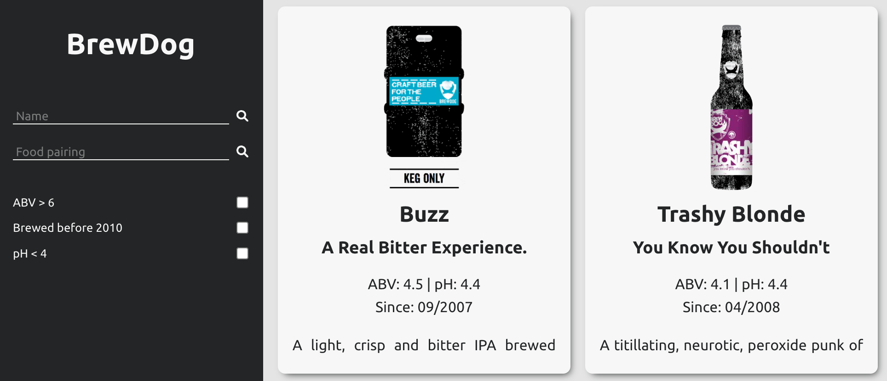

This project is built in React and fetches data from Punk API: https://punkapi.com/ to display beers and filter them to find those with an ABV > 6, brewed before 2010 or with a pH < 4. The beers can also be searched by name and food pairing and the results are paginated. React Testing Library has been used for testing.

Screenshot:

